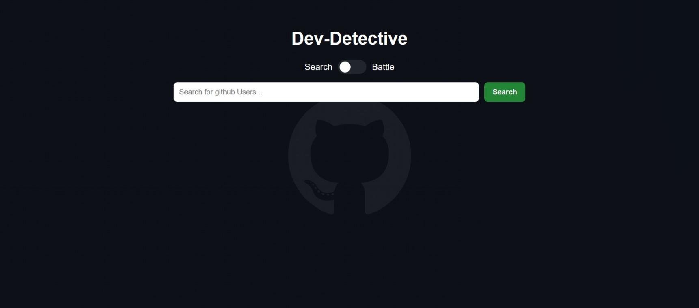
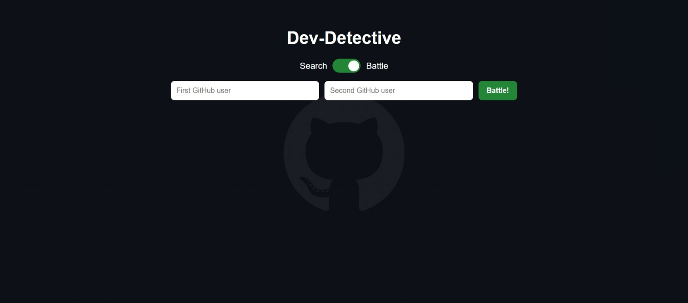
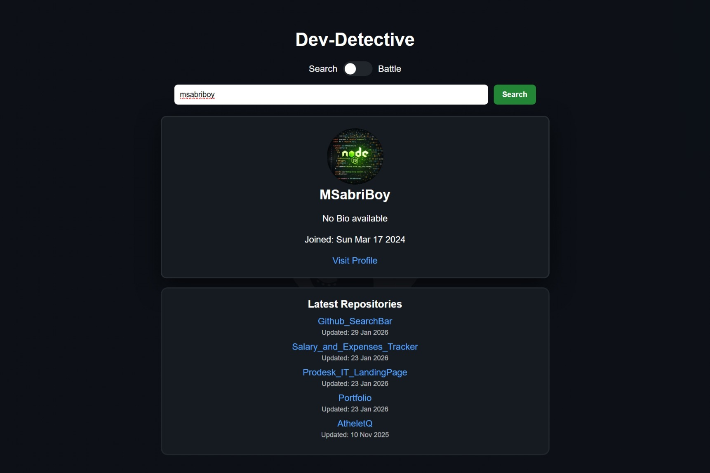
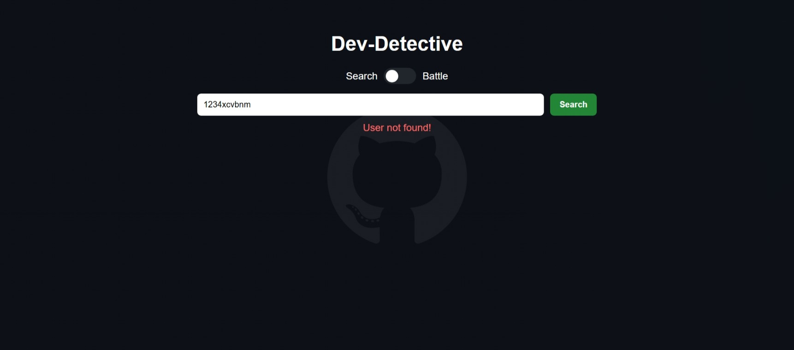
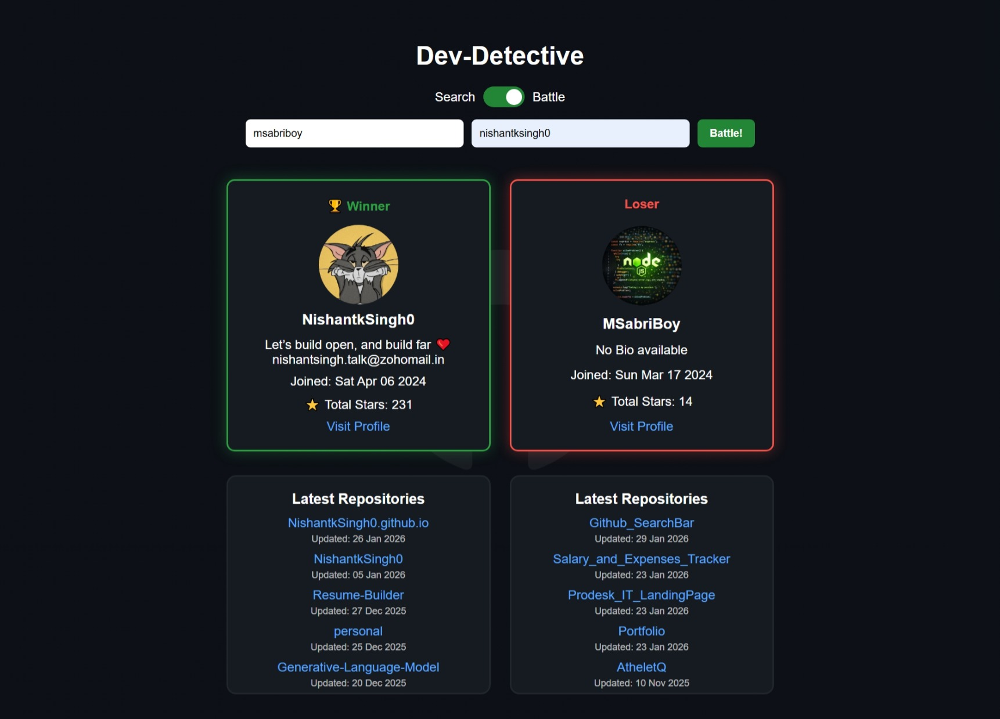
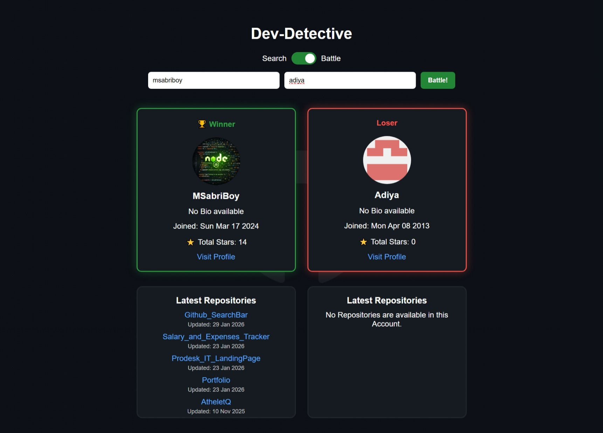
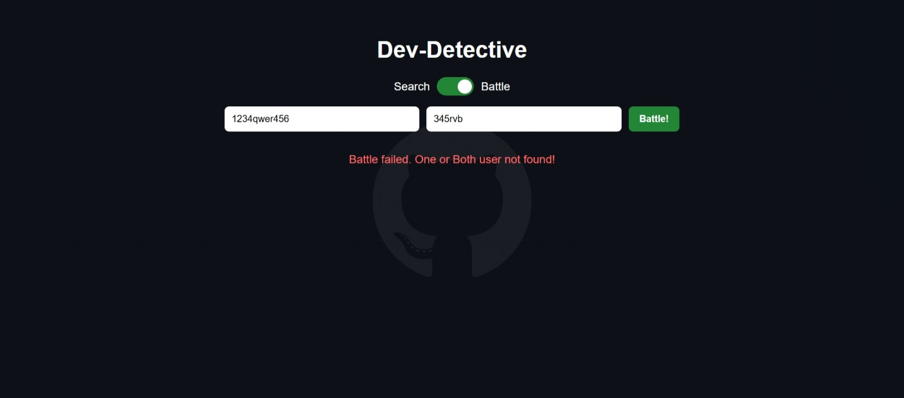
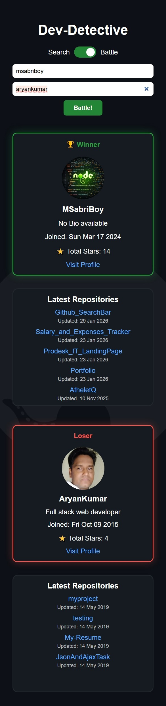

# 🚀 Dev-Detective — GitHub User Search & Battle App
## 🔗 Live Demo
https://msabriboy.github.io/Github_SearchBar/

## 📌 Overview
Dev-Detective is a modern JavaScript web application that connects to the GitHub REST API and allows users to:

- 🔍 Search any GitHub profile  
- 📊 View latest repositories  
- ⚔️ Compare two developers in Battle Mode  
- 🏆 Decide the winner based on total repository stars  

This project was built as part of a Week-3 learning challenge focused on:

APIs • Fetch • Async/Await • JSON • Error Handling • UI States

## ✨ Features

### 🔎 Search Mode

- Search for any GitHub username  
- Displays:
  - Avatar  
  - Name / Username  
  - Bio  
  - Join Date  
  - Profile Link  
- Fetches and shows Top 5 latest repositories  
- Repository names are clickable  
- Human-readable date formatting  
- Loading state while fetching  
- Graceful error handling for:
  - User not found  
  - API failures  

### ⚔️ Battle Mode

- Compare two GitHub users simultaneously  
- Fetches both profiles & repositories  
- Calculates Total Stars from repos  
- Highlights:
  - 🟢 Winner  
  - 🔴 Loser  
- Displays each user’s:
  - Profile card  
  - Latest repositories  
- Handles edge cases:
  - One or both users not found  
  - No repositories available  

### 📱 Responsive Design

- Works on desktop & mobile  
- Centered layout  
- Adaptive input fields & buttons  
- Clean UI with dark GitHub-style theme  

## 🛠️ Technologies Used

- HTML5  
- CSS3  
- JavaScript (ES6+)  
- GitHub REST API  
- Fetch API  
- Async / Await  

## ⚙️ How It Works

1. User enters a GitHub username.  
2. App calls:

```
https://api.github.com/users/{username}
```

3. Repository data is fetched from:

```
repos_url
```

4. Repositories are:
- Sorted by updated_at  
- Limited to 5  

5. Stars are summed in Battle Mode.  
6. UI updates dynamically.

## 🚦 Error Handling

- ❌ User not found → Friendly message shown  
- ⚠️ API limit exceeded → Error displayed  
- 📭 No repositories → “No repositories available” message  
- ⏳ Loading indicator while fetching  

## 🔑 API Rate Limit Notice

GitHub allows 60 unauthenticated requests per hour.

If you hit the limit:

- Wait for an hour  
OR  
- Add a GitHub Personal Access Token to headers.

Example:

```js
headers: {
  Authorization: "token YOUR_GITHUB_PAT"
}
```
## 🎯 Learning Outcomes

Through this project, I practiced:

- API integration  
- Async JavaScript  
- Promise handling  
- DOM manipulation  
- UI state management  
- Responsive layouts  
- Comparing datasets  
- Real-world error scenarios  

## 📸 Screenshots

### Desktop Views
<p align="center">
  
</p>
<p align="center">
  
</p>
<p align="center">
  
</p>
<p align="center">
  
</p>
<p align="center">
  
</p>
<p align="center">
  
</p>
<p align="center">
  
</p>

### Mobile View
<p align="center">
  
</p>

## ⭐ If You Like It

Give this repository a ⭐ and feel free to fork or improve it!
